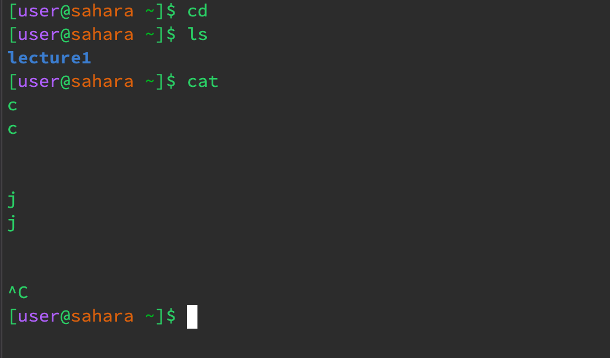
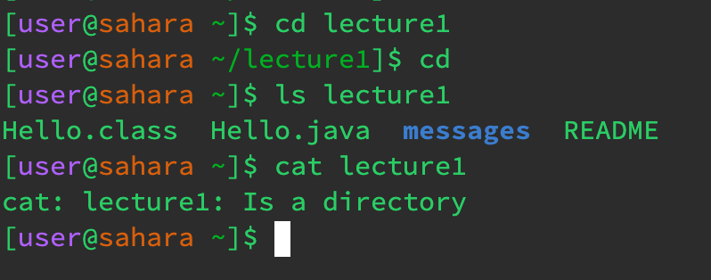

# CSE 15L Lab 1 Report

* The cd command in used to move between directories. Since there was no arguement, it didn't do anything.
* the ls command lists out the contents inside the current directory. So the current directory is /home so it lists Lecture1.
* the cat command prints contents of a file. If there is no arguement, it will just print out what you write in the terminal, you can exit by ctrl+c.

* The cd command, standing for "change directory", is an essential terminal command used to navigate the file system. By specifying a directory path as its argument, users can move to different locations within the file hierarchy. Simply typing cd with no arguments transports the user to their home directory. Furthermore, shortcuts like cd .. allow users to move up one directory level, making directory traversal efficient and intuitive.
* "ls lecture1 lists out the contents of the lecture1 directory.
* "cat lecture1" returns an error because this command is meant for files not directories.

* "cd Hello.java" command returns an error as Hello.java is a file and not a directory but the command is meant for directories.
* "ls Hello.java" command returns the name of the file passed as arguement/
* "cat Hello.java" prints out the content inside the file Hello.java which was passed as arguement.
