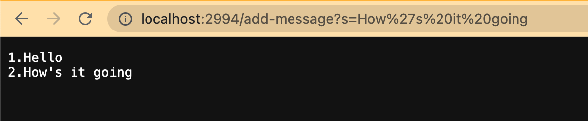
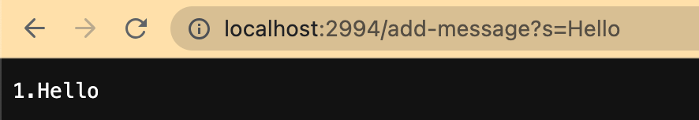
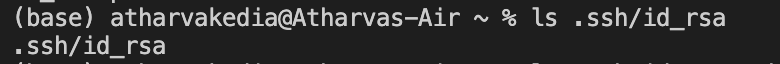
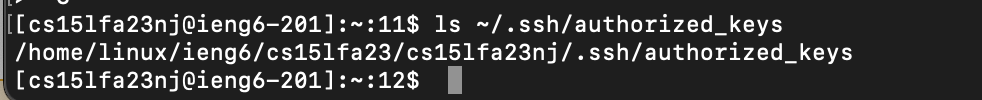
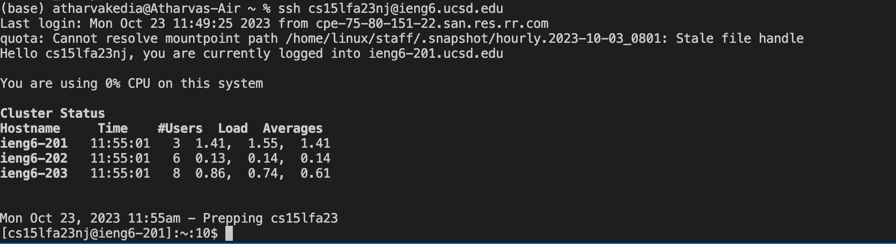

# Lab Report 2
# Part 1
## Code
```
import java.io.IOException;
import java.net.URI;
import java.util.ArrayList;
class Handler implements URLHandler {
    String line = "";
    int num = 0;
    public String handleRequest(URI url) {
        if (url.getPath().equals("/add-message"))
        {
            String[] parameters = url.getQuery().split("=");
            if(parameters[0].equals("s"))
            {
                num++;
                line += num + ". " + parameters[1] + "\n";
                return line;
} }
        return "404 Not Found!";
    }
}
class StringServer {
    public static void main(String[] args) throws IOException {
        if(args.length == 0){
            System.out.println(
                "Missing port number! Try any number between 1024 to 49151");
            return;
        }
        int port = Integer.parseInt(args[0]);
        Server.start(port, new Handler());
    }
}
```
## Server


* The method invoked as shown in the screenshot is handleRequest.
* The handleRequest method takes an argument named url, which is an instance of the URI class. The value associated with it is localhost:2500/add-message?s=Hello. Initially, the value was set to localhost:2500/.
*The pertinent attributes of the class include:
  - path: Retrieved via the getPath() method, its current value is /add-message. The default value for path was /, but it is updated in the screenshot due to a new request.
**query: Accessed by the getQuery() function, the current value is s=Hello. Initially, the query was null, reflecting the absence of a query component in the starting URL.
  - num: This variable keeps a count of the request's sequence number. Here, its value is 1 as this is the inaugural request. The num variable starts at 0 and increments with each new request, depending on whether the query includes /add-message.
  - parameters: An array splitting the query at the = sign, resulting in two elements. In this context, s forms the first element, and Hello constitutes the second.
  - line: It represents the output shown on the server, which corresponds to the text following the = in the URL after the query. As seen in the screenshot, line holds 1. Hello\n, which is subject to change with subsequent requests.


* the method that is executed is named handleRequest.
* handleRequest takes a parameter named url, which is an instance of the URI class. Initially, the value for this parameter is set to localhost:2500/, it then changes to  localhost:2500/add-message?s=Hello, and ultimately it shifts to localhost:2500/add-message?s=How%20are%20you.
* The fields of the class that are pertinent to this request include:
  - path: Accessed through the getPath() method, the path remains consistent at /add-message in the subsequent screenshot. This consistency is due to the path extraction process being      unaffected by the URL changes.
  - query: Retrieved by getQuery(), the value of this field is initially s=Hello and is later altered to s=How%20are%20you as depicted in the screenshots.
  - num: This integer field holds the sequence number for the requests received. Starting from 1 as shown in the earlier screenshot, it increments to 2 in the current request.
  - parameters: This array breaks down the query into segments divided by the = sign. In this instance, s is the segment before the sign, and How are you follows after.
  - line: This string displays on the server what follows the = in the URL within the query. For this screenshot, line is 1. Hello \n2. How are you. It is updated with each new request     made.
 
# Part 2
## Path to Private key

## Path to Public key

## Logginf into Ieng6 account without password

# Part 3
In labs two and three, I really got the hang of linking up to remote servers through the command line on my laptop. This is a skill I can see coming in super handy during internships, especially when I need to dial into a company's servers from a distance. I also got a good grip on how to get servers up and running online, and what goes on behind the scenes when we shoot requests across the web. Plus, I picked up a few handy terminal commands, like mkdir and scp, which I'm sure will be useful down the line.
