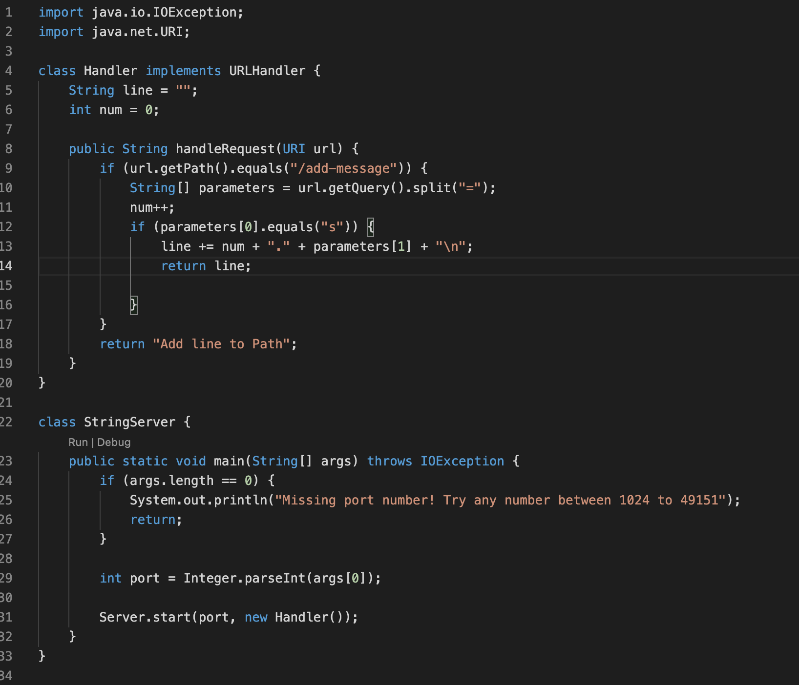

# Lab Report 2
# Part 1
## Code

## Server

* The method called is handleRequest in the above images
* The argument of handleRequest is url which is a member of the URI class. The initial value is localhost:2994/, which becomes localhost:2994/add-messages?s=Hello, and finally it becomes localhost:2994/add-message?s=How%27s%20it%20going.
* l
  *k
