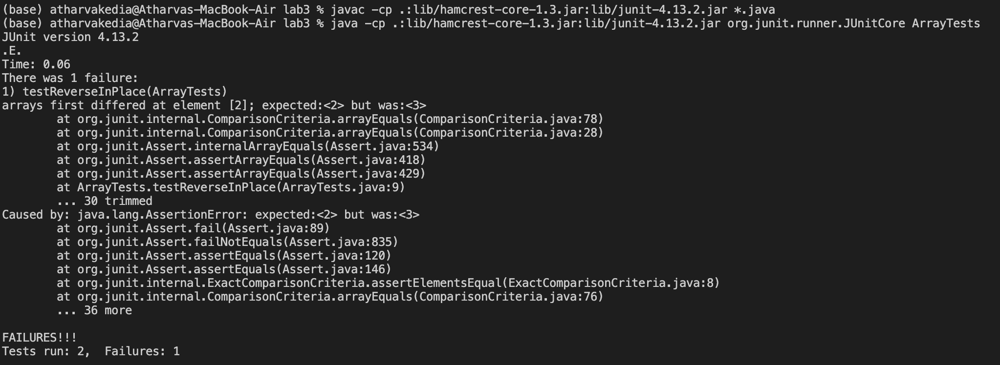
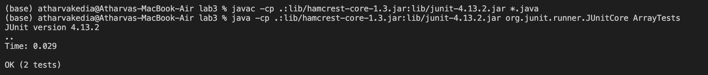
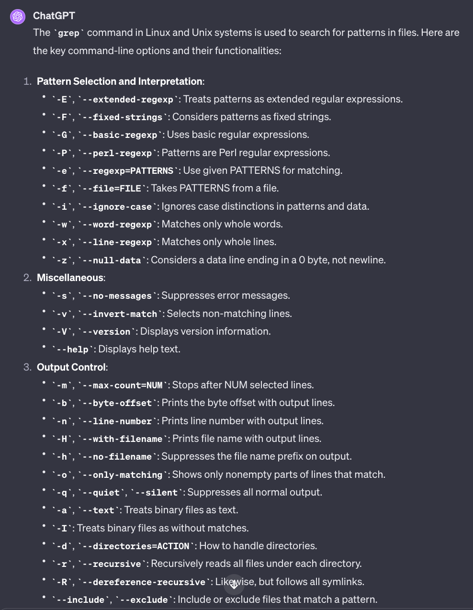
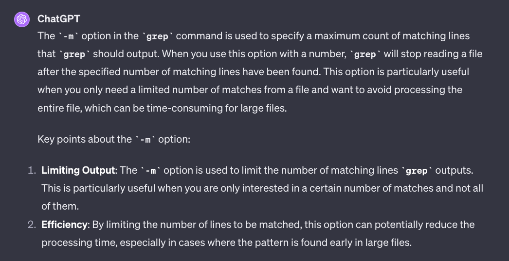

# Lab Report 3
# Part 1
## Failure inducing input
```
@Test
public void testReverseInPlace() {
    int[] input1 = {1, 2, 3, 4 };
    ArrayExamples.reverseInPlace(input1);
    assertArrayEquals(new int[]{4, 3, 2 , 1}, input1);
}
```
## Non-Failure inducing input
```
@Test
public void testReverseInPlace() {
    int[] input1 = { 3 };
    ArrayExamples.reverseInPlace(input1);
    assertArrayEquals(new int[]{ 3 }, input1);
}
```
## Symptom
Input:{1,2,3,4}



Input:{3}



## The Bug
In the initial code, the first half of the array's values were replaced, but the second half's values were incorrectly swapped. This issue arose because the values intended for the second half were lost when the first half was altered. To resolve this, a second array was introduced to hold the original array's values. Then, each value in the original array was replaced with the corresponding values from the second array, starting from the last index. This approach ensured the correct values were inserted into the array as intended.

# Original Code
```
static void reverseInPlace(int[] arr) {
  for(int i = 0; i < arr.length; i += 1) {
    arr[i] = arr[arr.length - i - 1];
  }
}
```

# Fixed Code
```
static void reverseInPlace(int[] arr) {
  int[] newArray = new int[arr.length];
  for(int i = 0;i < arr.length;i++) {
    newArray[i] = arr[i];
  }
  for(int i = 0; i < arr.length; i += 1) {
    arr[i] = newArray[arr.length - i - 1];
 }
}
```

## Part 2
# grep
# -i
- Example 1
  ```
  $ grep -i 'hello' example1.txt
      Hello World
      hello world
      HELLO WORLD
  ```
The -i command is used to perfrom a case-insensitive search for patterns in the file thats given. This is useful for perfoming searches for patterns efficiently as case does not matter.
In this case I entered the word "hello" as input and you can see that it gave an output of instances where study appears in both upper-case and lower-case.

- Example 2
  ```
  $ grep -i 'apple' example1.txt example2.txt

  ```It can also be used for checking patterns through multiple files.
In this case I used to it to search for places where the word "apple" shows up and since there are no instances of winter it does not give us an output.

# -v
- Example 1
  ```
  $ grep -v 'world' example1.txt
      HELLO WORLD
  ```
The -v command selects non-matching lines outputs search for patterns in the file thats given. This is useful for perfoming searches for patterns efficiently as case does not matter.
In this case I entered the word "world" as input and it outputs only HELLO WORLD because that is the only line that does not mathc the pattern "world

- Example 2
  ```
  $ grep -v 'Banana' example2.txt
      Apple
      Orange
      apple
      banana
      orange

  ```
This command selects lines from example2.txt that do not contain "Banana". It excludes the line with "Banana" but includes "banana" due to case sensitivity.

# -n
- Example 1
  ```
  $ grep -n 'world' example1.txt
      1:Hello World
      2:hello world
      4:Hi World
  ```
The -n command is used to display the line numbers of lines that correspont to a pattern and the parts of the lines that correspond to the patters. It is useful when you are searching for specific keywords in the text and the information around them, and don’t have the time to search for them manually.
This command searches for "world" in example1.txt and displays the matching lines along with their line numbers.

- Example 2
  ```
  $ grep -n 'banana' example2.txt
      2:Banana
      5:banana

  ```
This command finds "banana" in example2.txt and displays the lines that contain it, along with their line numbers.

# -m
- Example 1
  ```
  $ grep -m 1 'world' example1.txt
      Hello World
  ```

The -m option in the grep command is used to specify a maximum count of matching lines that grep should output. When you use this option with a number, grep will stop reading a file after the specified number of matching lines have been found. This option is particularly useful when you only need a limited number of matches from a file and want to avoid processing the entire file, which can be time-consuming for large files.
This command stops searching after the first match of "world" in example1.txt.

- Example 2
  ```
  $ grep -m 2 'apple' example2.txt
      Apple
      apple

  ```
This command stops after finding the first two instances of "apple" in example2.txt, regardless of case

## Acknowledgement of Source(GPT4)

I would like to acknowledge the usage of GPT4 in the completeion of Lab Report 4.
Following are my promts and its responses:
- Prompt: grep command line options
- Output: 

- Implementation: After using it to find multiple command-line options for grep, I chose 4 of the command-line options and used those in my Lab-report.

- Prompt: explain more on -m option for grep
- Output: 


