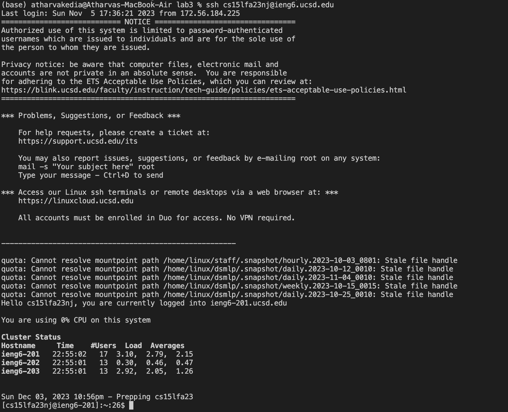
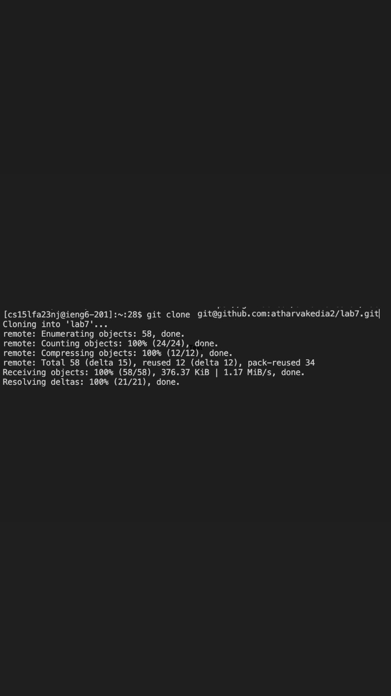
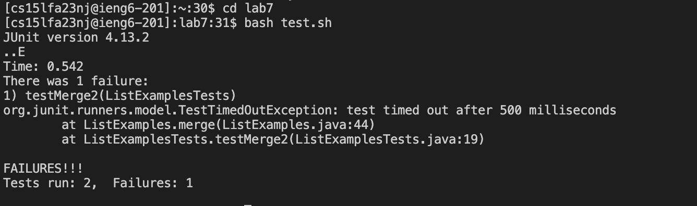
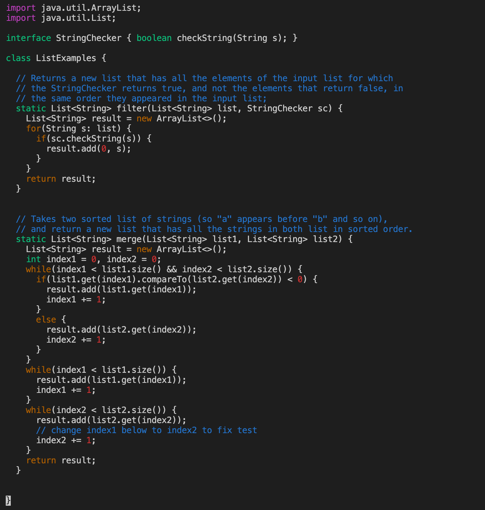
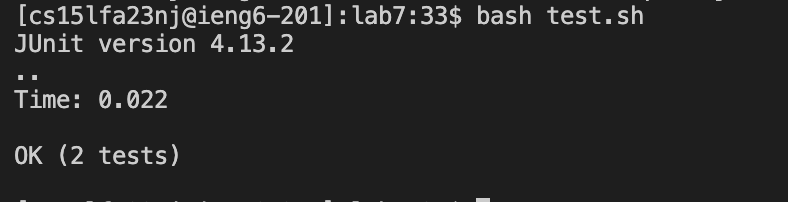
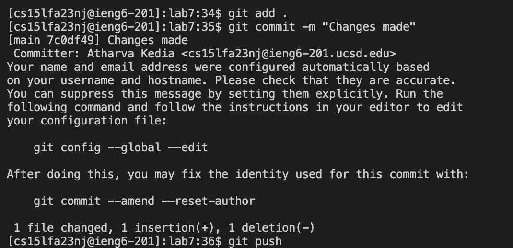
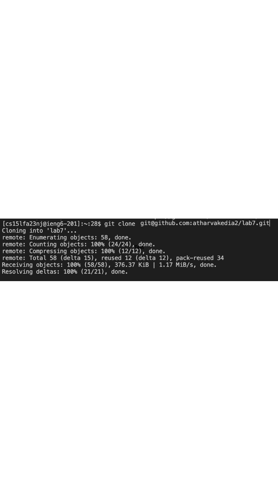

# Lab Report 4
# Part 1
## Logging into ieng6



``` ssh cs15lfa23nj@ieng6.ucsd.edu ```
## Cloning fork


``` git clone git@github.com:atharvakedia2/lab7.git ```
## Test



``` bash test.sh ```

## Fixing the code



```vim ListExamples.java```
```<k> ``` and ```<l>``` keys to navigate through the file
```<i>``` to insert. I used it to add 2 to index from the previous line. This makes it index2 .
```<ESC>``` to exit the insert mode.
```:wq``` Save and exit.

## Testing again

```bash test.sh```
## Pushing changes


```git add .``` stage changes for the next commit for all files in the directory
```git commit -m "Changes made"``` save the changes for all files in your local r
```git push``` save the changes to the github repository
Below is a screenshot that reflects that changes were made in the forked repository on my github.


